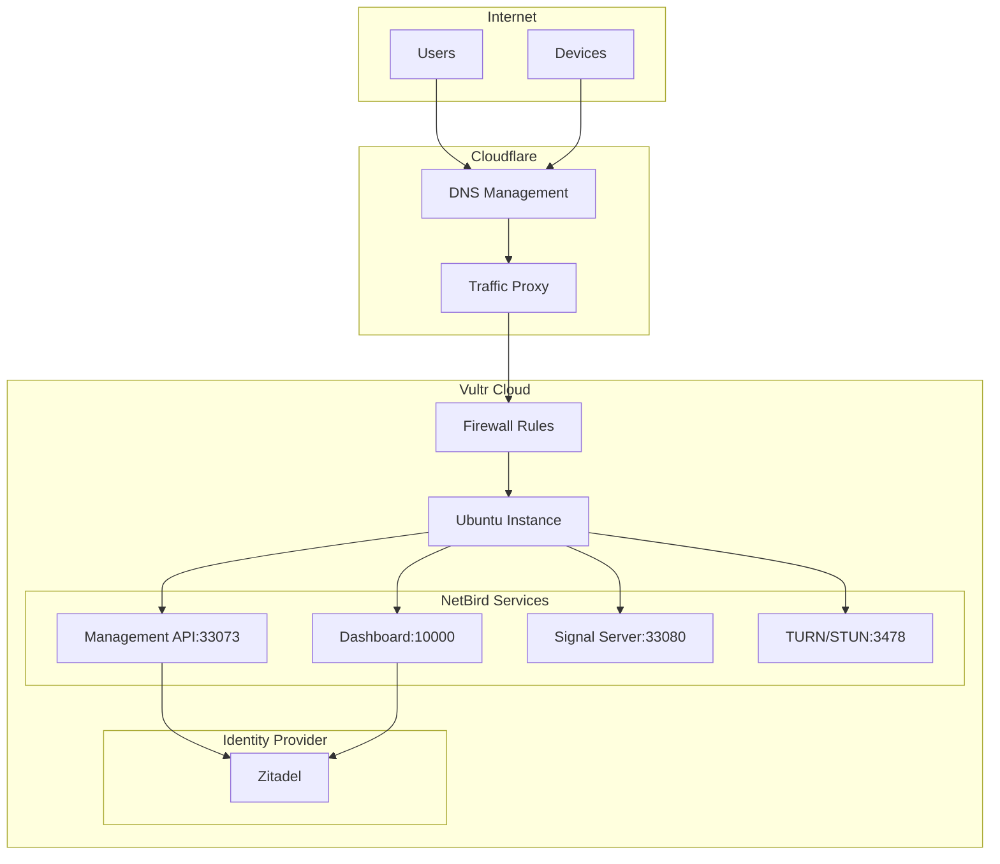

# NetBird Self-Hosted Terraform Module

[](https://opensource.org/licenses/MIT)
[](https://www.terraform.io/)
[](https://vultr.com)
[](https://cloudflare.com)

A Terraform module for deploying NetBird self-hosted with Zitadel as the identity provider on Vultr infrastructure with Cloudflare DNS integration.

## 📋 Overview

This module automates the deployment of:
- **Vultr instance** with configurable specifications
- **Firewall rules** for NetBird services
- **Cloudflare DNS records** with proxy support
- **NetBird + Zitadel** installation via cloud-init

## 🏗️ Architecture

This module creates a complete NetBird self-hosted infrastructure with the following components:

### 🌐 Network Flow


### 📋 Component Overview

| Component | Description | Ports |
|-----------|-------------|-------|
| **Cloudflare DNS** | Domain management and traffic proxying | 80, 443 |
| **Vultr Firewall** | Network security and access control | Custom rules |
| **NetBird Management** | Device management and configuration | 33073 |
| **NetBird Dashboard** | Web-based administration interface | 10000 |
| **NetBird Signal** | Peer discovery and signaling | 33080 |
| **TURN/STUN Server** | NAT traversal for peer connections | 3478, 49152-65535 |
| **Zitadel** | Identity and access management | Integrated |

### 🔄 Data Flow

1. **DNS Resolution**: Requests hit Cloudflare DNS for domain resolution
2. **Traffic Routing**: Cloudflare proxies traffic to Vultr instance (optional)
3. **Firewall Filtering**: Vultr firewall applies security rules
4. **Service Distribution**: Traffic routes to appropriate NetBird services
5. **Authentication**: Zitadel handles user authentication and authorization
6. **Peer Management**: NetBird manages device connections and network policies

## 🚀 Quick Start

### Prerequisites

- [Terraform](https://www.terraform.io/downloads.html) >= 1.0
- [Vultr account](https://vultr.com) with API access
- [Cloudflare account](https://cloudflare.com) with API token
- Domain managed by Cloudflare
- SSH key uploaded to Vultr

### 1. Setup

Clone this repository and navigate to the directory:
```bash
git clone <repository-url>
cd terraform-vultr-netbird
```

### 2. Configure Variables

Copy the example configuration:
```bash
cp terraform.tfvars.example terraform.tfvars
```

Edit `terraform.tfvars` with your values:
```hcl
# Required variables
vultr_api_key        = "your-vultr-api-key"
cloudflare_api_token = "your-cloudflare-token"
ssh_key_ids          = ["your-ssh-key-id"]
ssh_allowed_ip       = "your.ip.address.here"
domain_name          = "yourdomain.com"
subdomain_name       = "netbird"
```

### 3. Deploy

```bash
# Initialize Terraform
terraform init

# Validate configuration
terraform validate

# Plan deployment
terraform plan

# Apply changes
terraform apply
```

## 📊 Outputs

After successful deployment:

```hcl
netbird_url = "https://netbird.yourdomain.com"
netbird_instance_info = {
  instance_ip = "203.0.113.1"
  login       = "ssh linuxuser@203.0.113.1 -i ~/.ssh/your-key"
  password    = "generated-password"
  username    = "linuxuser"
}
netbird_dns_info = {
  hostname = "netbird.yourdomain.com"
  proxied  = true
}
```

### NetBird Credentials

Access the NetBird dashboard at the URL provided in outputs. Admin credentials are located in:

```bash
ssh linuxuser@<instance-ip> -i ~/.ssh/your-key
cat /home/linuxuser/netbird/setup.log
```

Example credentials output:
```
Done!

You can access the NetBird dashboard at https://netbird.example.com
Login with the following credentials:
Username: admin@netbird.example.com
Password: FIvjywviE1PUywSyoKcUaI1tr7rHN/bisZcWfKilQ4o@
[2025-08-11T02:11:19+00:00] Setup complete
```

## 🔧 Configuration

### Input Variables

#### Required Variables

| Name | Type | Description |
|------|------|--------------|
| `vultr_api_key` | `string` | Vultr API key for resource management |
| `cloudflare_api_token` | `string` | Cloudflare API token for DNS management |
| `ssh_key_ids` | `list(string)` | SSH key IDs from your Vultr account |
| `ssh_allowed_ip` | `string` | IP address/CIDR allowed for SSH access |
| `hostname` | `string` | Instance hostname |
| `label` | `string` | Instance label for identification |
| `region` | `string` | Vultr region code (e.g., 'ewr', 'lax') |
| `firewallgroup_name` | `string` | Name for the firewall group |
| `domain_name` | `string` | Domain name for DNS record |
| `subdomain_name` | `string` | Subdomain for NetBird service |
| `dns_record_comment` | `string` | Comment for the DNS record |

#### Optional Variables

| Name | Type | Default | Description |
|------|------|---------|-------------|
| `plan` | `string` | `"vc2-1c-2gb"` | Vultr instance plan |
| `os_id` | `number` | `2571` | OS ID (Ubuntu 24.04 LTS) |
| `activation_email` | `bool` | `false` | Send activation email |
| `environment` | `string` | `"prod"` | Environment tag |
| `enable_backups` | `bool` | `false` | Enable instance backups |
| `enable_ddos_protection` | `bool` | `false` | Enable DDoS protection |
| `enable_ipv6` | `bool` | `false` | Enable IPv6 |
| `dns_record_proxied` | `bool` | `true` | Proxy DNS through Cloudflare |
| `dns_record_ttl` | `number` | `1` | DNS record TTL |
| `custom_tcp_ports` | `list(string)` | `[]` | Override default TCP ports |
| `custom_udp_ports` | `list(string)` | `[]` | Override default UDP ports |
| `additional_tags` | `map(string)` | `{}` | Additional resource tags |

### Default Network Ports

#### TCP Ports
- `80`: HTTP traffic
- `443`: HTTPS traffic
- `33073`: NetBird Management API
- `10000`: NetBird Dashboard
- `33080`: NetBird Signal Server

#### UDP Ports
- `3478`: STUN/TURN server
- `49152-65535`: Dynamic port range for TURN relay

## 🏷️ Tagging Strategy

All resources are automatically tagged with:
- `Project`: "netbird"
- `Environment`: Variable-defined environment
- `ManagedBy`: "terraform"
- Additional custom tags via `additional_tags` variable

## 🔒 Security Features

- **SSH Access Control**: Configurable IP/CIDR restrictions
- **Firewall Rules**: Minimal required ports only
- **DDoS Protection**: Optional Vultr DDoS protection
- **Cloudflare Proxy**: Optional traffic proxying and protection
- **Limited User**: Instance runs with limited user privileges

## 🛠️ Advanced Usage

### Custom Port Configuration

```hcl
custom_tcp_ports = ["80", "443", "8080", "9090"]
custom_udp_ports = ["3478", "5000-6000"]
```

### Multiple Environments

```hcl
environment = "staging"
additional_tags = {
  Owner       = "DevOps Team"
  CostCenter  = "IT-Infrastructure"
  Backup      = "daily"
}
```

### Enhanced Security

```hcl
enable_ddos_protection = true
enable_backups         = true
ssh_allowed_ip         = "192.168.1.0/24"  # Restrict to internal network
```

## 📁 Module Structure

```
.
├── main.tf                           # Root module configuration
├── variables.tf                      # Input variables
├── outputs.tf                        # Output values
├── locals.tf                         # Local values and logic
├── providers.tf                      # Provider configurations
├── terraform.tfvars.example          # Example configuration
├── modules/
│   ├── vultr-instance/               # Vultr instance module
│   │   ├── main.tf
│   │   ├── variables.tf
│   │   ├── outputs.tf
│   │   └── versions.tf
│   └── cloudflare-dns-record/        # Cloudflare DNS module
│       ├── main.tf
│       ├── variables.tf
│       ├── outputs.tf
│       └── versions.tf
└── templates/
    └── netbird_setup.sh.tmpl         # NetBird installation script
```

## 🔍 Troubleshooting

### Common Issues

1. **SSH Connection Failed**
   - Verify `ssh_allowed_ip` includes your current IP
   - Check SSH key is properly uploaded to Vultr

2. **DNS Resolution Issues**
   - Ensure domain is managed by Cloudflare
   - Verify API token has DNS edit permissions

3. **NetBird Setup Incomplete**
   - Check `/var/log/cloud-init-output.log` on the instance
   - Review `/home/linuxuser/netbird/setup.log` for errors

### Accessing Installation Logs

```bash
# SSH into the instance
ssh linuxuser@<instance-ip> -i ~/.ssh/your-key

# Check cloud-init status
sudo cloud-init status

# View detailed logs
sudo cat /var/log/cloud-init-output.log
cat /home/linuxuser/netbird/setup.log
```

## 🔄 Maintenance

### Updating NetBird

NetBird updates should be performed manually on the instance:

```bash
ssh linuxuser@<instance-ip> -i ~/.ssh/your-key
cd /home/linuxuser/netbird
sudo docker-compose pull
sudo docker-compose up -d
```

### Backup Considerations

- Enable `enable_backups = true` for automatic Vultr snapshots
- Consider backing up NetBird configuration and data volumes
- Document your Zitadel configuration for disaster recovery

## 📚 References

- [NetBird Documentation](https://docs.netbird.io/)
- [NetBird Self-hosting Guide](https://docs.netbird.io/selfhosted/selfhosted-quickstart)
- [Vultr API Documentation](https://www.vultr.com/api/)
- [Cloudflare API Documentation](https://developers.cloudflare.com/api/)
- [Terraform Vultr Provider](https://registry.terraform.io/providers/vultr/vultr/latest/docs)
- [Terraform Cloudflare Provider](https://registry.terraform.io/providers/cloudflare/cloudflare/latest/docs)
---
